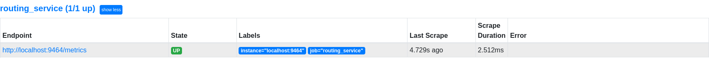

# OpenTelemetry Adapter Case+Code

## Introduction

Application telemetry refers to the collection, monitoring, and analysis of data generated by an application during its operation. This data provides critical insights into an application's performance, usage patterns, and potential issues, enabling developers and operators to optimize functionality, diagnose problems, and ensure reliability. Telemetry is essential for understanding the health and efficiency of modern distributed systems, where real-time visibility into application-level behavior is a cornerstone of successful system management. 

Telemetry data can be generated at three different levels:

* Application: Telemetry data generated when you instrument your own applications.
* Middleware: Telemetry data generated by Connext DDS entities and infrastructure services.
* System: DevOps telemetry such as CPU, memory, and disk I/O usage.

RTI® Connext® Observability Framework is a holistic solution that uses telemetry data to provide deep visibility into the current and past states of your Connext applications. This visibility makes it easier to proactively identify and resolve potential system issues, providing a higher level of confidence in the reliable operation of the system. 

At the time of writing, RTI's Observability Framework supports middleware telemetry (metrics and logs) and application logs only. While visibility into the middleware is of great value, it would be beneficial to be able to capture and include application-level metrics in the dashboards.
 
This Case+Code details the process of creating an adapter for [RTI's Routing Service](https://community.rti.com/static/documentation/connext-dds/current/doc/manuals/connext_dds_professional/services/routing_service/index.html) to collect application-level metrics published on a DDS topic. The adapter will transform and expose this telemetry data in a format compatible with Prometheus, a widely-used open-source monitoring system. Additionally you will learn how to visualize the application-level metrics alongside Connext DDS telemetry in a Grafana dashboard, enabling a unified and comprehensive monitoring experience.  

Through this guide, you will learn to:  
1. Develop a custom Routing Service adapter for application telemetry.  
2. Configure Prometheus to scrape and display application telemetry data.  
3. Integrate application telemetry into Grafana for a combined view with Connext telemetry.  

By the end, you'll have a robust solution for monitoring both DDS system performance and application-level insights, helping you maximize the value of your telemetry data.

## Cloning the repository

To clone the repository you will need to run git clone as follows to download both the repository and its submodule dependencies:

```bash
git clone --recurse-submodule https://github.com/rticommunity/rticonnextdds-usecases-tsn-arch-sim.git
```

If you forget to clone the repository with --recurse-submodule, simply run the following command to pull all the dependencies:

```bash
git submodule update --init --recursive
```

## Build Docker image
This Case+Code is encapsulated inside a Docker container for convenience, and once the repository has been cloned, the next step to configure a Docker image. During the image build process, the applications associated with this Case+Code will be automatically compiled and included inside the Docker image. These applications will be accessible in the resulting image at the /root/ directory."

There is a docker file in the docker subdirectory. To create the docker image adjust the line in the Dockerfile that reads ENV TZ=Europe/Madrid to set the correct timezone, then run the following command to build the Connext image for the 7.3.0 release, take into account that you are accepting the RTI license agreement by setting the RTI_LICENSE_AGREEMENT_ACCEPTED argument to "accepted":

```bash
docker build -t connext:oteladapter -f docker/Dockerfile --build-arg RTI_LICENSE_AGREEMENT_ACCEPTED=accepted --build-arg CONNEXT_VERSION=7.3.0 .
```

If you want to target a different version of Connext, then you must set the following arguments to match your requirements

* CONNEXT_VERSION: supported values are 7.3.0 and 6.1.2

Here's an example of what that would look like for a 6.1.2 release:

```bash
docker build -t connext:oteladapter -f docker/Dockerfile --build-arg RTI_LICENSE_AGREEMENT_ACCEPTED=accepted --build-arg CONNEXT_VERSION=6.1.2 .
```

## Data model

The first challenge is to come up with [a data model](generator/telemetry.idl) that reflects our needs: routing telemetry data to Prometheus via DDS. The most straight-forward way would be to establish a data model which defines a set of metrics and their associated data structures which can be easily mapped to OpenTelemetry concepts. The use of `@appendable` annotations ensures extensibility, allowing the model to evolve without breaking compatibility, which is crucial for observability frameworks like OpenTelemetry.

### IDL Data Model and OpenTelemetry Mapping

#### Module: `Metrics`
This module encapsulates all the metric-related types and definitions. In OpenTelemetry, this would correspond to the namespace or package that organizes metric-related data.

---

#### **Typedefs**
1. **`MetricName`**: A string with a maximum length of 256 characters.
   - **OpenTelemetry Mapping**: Represents the name of a metric, such as "http_requests_total" or "cpu_usage".
   
2. **`MetricDescription`**: A string with a maximum length of 512 characters.
   - **OpenTelemetry Mapping**: Provides a human-readable description of the metric, explaining its purpose or usage.

3. **`MetricUnit`**: A string with a maximum length of 64 characters.
   - **OpenTelemetry Mapping**: Specifies the unit of measurement for the metric (e.g., "seconds", "bytes", "requests").

4. **`LabelKey` and `LabelValue`**: Strings with a maximum length of 256 characters.
   - **OpenTelemetry Mapping**: Represent the keys and values of labels (or attributes) associated with metrics. Labels provide additional context, such as "region=us-west" or "status=200".

---

#### **Structs**
1. **`UInt64Counter` and `DoubleCounter`**
   - **Fields**:
     - `value`: Represents the counter value.
   - **OpenTelemetry Mapping**: These correspond to counter metrics, which are used to represent a cumulative value that only increases (e.g., total requests served).

2. **`Label`**
   - **Fields**:
     - `key`: The label key.
     - `value`: The label value.
   - **OpenTelemetry Mapping**: Represents a single label (attribute) key-value pair.

3. **`UInt64Histogram` and `DoubleHistogram`**
   - **Fields**:
     - `labels`: A sequence of `Label` structs.
     - `buckets`: A sequence of bucket values (either `uint64` or `double`).
   - **OpenTelemetry Mapping**: These represent histogram metrics, which are used to measure the distribution of values (e.g., request latency). The `labels` provide context, and the `buckets` define the histogram's distribution.

4. **`UInt64UpDownCounter` and `DoubleUpDownCounter`**
   - **Fields**:
     - `value`: Represents the counter value.
   - **OpenTelemetry Mapping**: These correspond to up-down counters, which can increase or decrease (e.g., active connections).

---

#### **Union: `MetricUnion`**
- **Fields**:
  - Switches between different metric types (`UInt64Counter`, `DoubleCounter`, `UInt64Histogram`, `DoubleHistogram`, `UInt64UpDownCounter`, `DoubleUpDownCounter`).
- **OpenTelemetry Mapping**: Represents a polymorphic metric type, allowing a single metric to be one of several types. This is similar to how OpenTelemetry supports multiple metric types under a unified API.

---

#### **Struct: `Metric`**
- **Fields**:
  - `name`: The metric's name (keyed).
  - `description`: A description of the metric.
  - `unit`: The unit of measurement (keyed).
  - `data`: The metric data, represented by the `MetricUnion`.
- **OpenTelemetry Mapping**: This struct encapsulates all the information about a single metric, including its metadata (name, description, unit) and its actual data (value or distribution). It aligns closely with OpenTelemetry's metric data model.

---

## Adapter

A Routing Service adapter is a pluggable component in RTI Routing Service that enables the service to interact with different data domains. These adapters are designed to consume and produce data from various sources, such as DDS, MQTT, sockets, files, and more. They act as a bridge between the Routing Service and the specific data domain, allowing data to flow seamlessly between them.

Adapters are responsible for:
* Input Adapters: Collecting data samples from a data domain and passing them to the Routing Service engine.
* Output Adapters: Sending data from the Routing Service to a data domain, potentially applying transformations beforehand.

The adapter architecture supports custom implementations, enabling developers to create adapters tailored to their specific integration needs. For example, a file adapter can read data from a file and send it to a DDS domain, or vice versa.

In this Case+Code, we've created an Output Adapter using [OpenTelemetry C++](https://opentelemetry.io/docs/languages/cpp/) which provides data to [Prometheus](https://prometheus.io/) through its Prometheus Exporter, which enables metrics collected by the OpenTelemetry SDK to be scraped by Prometheus. 

The first step is to initialize and configure the Prometheus Exporter in the adapter application. This involves creating an instance of the exporter and setting up the endpoint where metrics will be exposed. This is performed in [otelconnextion.cxx](src/otelconnection.cxx) where the properties required for the endpoint are read from the routing service Quality of Service definition. When the routing service asks the adapter to provide a stream writer, the adapter returns an instance of the OpenTelemetryStreamWriter class. This class' main function, write, takes a collection of samples and using the Dynamic Data API, determines the correct OpenTelemetry C++ type to create from the sample and converts the data contained in the sample to an OpenTelemetry metric.


## Configuration of the routing service

TODO: This is the raw chatbot output, needs editing fr clarity, brevity, style


The provided Routing Service configuration is an XML file that defines a setup for integrating OpenTelemetry with RTI Connext DDS. Below is an annotated explanation of the configuration:

---

### **Root Element: `<dds>`**
- **Namespace and Schema**:
  - The `xmlns:xsi` attribute specifies the XML Schema Instance namespace.
  - The `xsi:noNamespaceSchemaLocation` attribute points to the schema definition for RTI Routing Service version 7.3.0. This ensures the XML adheres to the expected structure and syntax.

---

### **Configuration Variables: `<configuration_variables>`**
This section defines variables that can be used throughout the configuration.

1. **`SCRAPE_URL`**:
   - **Value**: `0.0.0.0:9464`
   - **Purpose**: Specifies the URL where metrics can be scraped. This is likely used for exposing metrics in a Prometheus-compatible format, as is common in OpenTelemetry setups.

2. **`EXPORT_DEBUG`**:
   - **Value**: `true`
   - **Purpose**: Enables debug-level logging for exporting metrics. This is useful for troubleshooting and verifying the integration.

---

### **Plugin Library: `<plugin_library>`**
This section defines a custom adapter plugin for the Routing Service.

1. **`name="AdapterLib"`**:
   - The name of the plugin library.

2. **`<adapter_plugin>`**:
   - **`name="OpenTelemetryAdapter"`**: The name of the adapter plugin.
   - **`<dll>`**: Specifies the shared library (`oteladapter`) that implements the adapter.
   - **`<create_function>`**: Specifies the function (`OpenTelemetryAdapter_create_adapter_plugin`) used to create an instance of the adapter plugin.

   **Purpose**: This plugin is responsible for integrating OpenTelemetry with the Routing Service, enabling the collection and export of telemetry data.

---

### **Routing Service: `<routing_service>`**
This section defines the Routing Service instance.

1. **`name="OpenTelemetryGateway"`**:
   - The name of the Routing Service instance.

2. **Domain Route: `<domain_route>`**
   - **`name="DDSOtel"`**: The name of the domain route, which connects DDS with OpenTelemetry.

3. **Connection: `<connection>`**
   - **`name="OpenTelemetryConnection"`**: The name of the connection.
   - **`plugin_name="AdapterLib::OpenTelemetryAdapter"`**: Specifies the plugin to use for this connection. It references the `OpenTelemetryAdapter` defined earlier.

   **Purpose**: This connection establishes the link between DDS and OpenTelemetry, enabling data to flow between the two systems.

---

### **Summary**
This configuration sets up an RTI Routing Service instance named `OpenTelemetryGateway` to integrate with OpenTelemetry using a custom adapter plugin. It defines:
- Configuration variables for scraping metrics and enabling debug logging.
- A plugin library (`AdapterLib`) with an adapter plugin (`OpenTelemetryAdapter`) for OpenTelemetry integration.
- A domain route (`DDSOtel`) with a connection (`OpenTelemetryConnection`) that uses the adapter plugin.

This setup is designed to enable the collection and export of telemetry data from RTI Connext DDS to OpenTelemetry-compatible systems, such as Prometheus.


## Generator

TODO:

* What is the generator for?
* How to run it?

## Running the RTI Routing Service with the opentelemetry plugin
rtiroutingservice -cfgFile ./RsTelemetryGateway.xml -cfgName "OpenTelemetryGateway"


## Running the router+generator at the same time using TMUX


https://ryan.himmelwright.net/post/scripting-tmux-workspaces/


Certainly! Here's a step-by-step guide to run two terminal applications simultaneously using a split screen in **tmux**:


---

### **1. Start tmux**
Open a terminal and start a tmux session by running:

```bash
tmux
```

---

### **2. Split the Screen**
You can split the tmux window into panes:

- **Horizontally** (one above the other):  
  Press `Ctrl-b` followed by `%`.
  
- **Vertically** (side-by-side):  
  Press `Ctrl-b` followed by `"`.

---

### **3. Run Applications in Each Pane**
Once you have split the screen:
1. Move between panes using `Ctrl-b` and the arrow keys.
2. In each pane, you can run a terminal application or command. For example:
   - In one pane, run `top` to monitor system processes.
   - In the other pane, run `htop`, `ping`, or any other terminal application.

---

### **4. Resize Panes (Optional)**
You can resize the panes to adjust their sizes:
- Press `Ctrl-b` followed by `Ctrl-arrow key` to resize the pane in the direction of the arrow key.

---

### **5. Exit or Detach the Session**
- To **detach** the tmux session and leave it running in the background, press `Ctrl-b` followed by `d`.
- To **exit** a pane, type `exit` in the pane.

---

### **Example Workflow**
1. Start tmux:
   ```bash
   tmux
   ```
2. Split the screen vertically:
   Press `Ctrl-b` then `%`.
3. In the left pane, run:
   ```bash
   htop
   ```
4. Move to the right pane using `Ctrl-b` and the right arrow key.
5. In the right pane, run:
   ```bash
   tail -f /var/log/syslog
   ```

Now you can monitor system processes and logs side by side!

---

### **6. Reattach tmux (if Detached)**
If you detach from the session, you can reattach it using:

```bash
tmux attach
``` 


## Configuration of Prometheus

### Integration with RTI Observability Platform

Before completing this section, you'll need to have the RTI Observability Platform installed and configured. See [the installation instructions](https://community.rti.com/static/documentation/connext-dds/current/doc/manuals/addon_products/observability/install.html) to find out how to do that.


### Configuration
Add a new job to the Observability platform's Prometheus configuration in {$HOME}/rti_workspace/7.3.0/user_config/observability/prometheus/prometheus.yml

Configuration options can be set in the `config.json` file. Below is an example configuration:
```yaml
scrape_configs:
  #
  # Configuration for Prometheus exporter in a system
  #      
  # The job name is added as a label `job=<job_name>` to any timeseries scraped from this config.
  #
  - job_name: 'prometheus'

    # metrics_path defaults to '/metrics'
    # scheme defaults to 'http'.

    static_configs:
    - targets: 
      - localhost:9090 # Prometheus metrics
      
  - job_name: 'routing_service'      
    static_configs:
    - targets:
      - localhost:9464 # Application metrics provided by the routing service adapter
```
Save and (re)start the observability platform:
```bash
rtiobservability -t && rtiobservability -i
```

Navigate in a web-browser to [the local Prometheus UI](http://localhost:9090), click on "Status" in the menu bar, then "Targets". You should see a list of all the scrape targets, including the Routing Service Adapter scrape target



Clicking on the Endpoint, will open the webpage, hosted by the adapter showing the raw metric data that Prometheus scrapes


## Grafana

Certainly! Here’s a step-by-step guide and an example of adding Prometheus-provided metrics to a Grafana dashboard.

---

### **Step 1: Set Up Grafana with Prometheus as a Data Source**
1. **Login to Grafana**: Open Grafana in your browser and log in.
2. **Add Prometheus as a Data Source**:
   - Go to **Configuration > Data Sources**.
   - Click **Add data source** and select **Prometheus**.
   - Enter the URL for your Prometheus server (e.g., `http://localhost:9090`) and save.

---

### **Step 2: Create a New Dashboard**
1. In the Grafana menu, click **Dashboards > New Dashboard**.
2. Choose **Add a new panel**.

---

### **Step 3: Query Prometheus for Metrics**
1. In the **Query** section of the panel editor:
   - Set the **Data Source** to Prometheus.
   - Enter your Prometheus query in the **Metric** field (e.g., `http_requests_total`).
   - Click **Run Query** to see the result preview.
   
   Example Prometheus Queries:
   - **`http_requests_total`**: Total number of HTTP requests.
   - **`rate(http_requests_total[1m])`**: Per-second rate of HTTP requests over the last minute.
   - **`up`**: Checks whether a target is up and running.

---

### **Step 4: Configure Visualization**
1. **Visualization Type**:
   - Choose the type of graph or chart you want (e.g., Time series, Gauge, Bar graph).
   - This option is available in the **Visualization** tab of the panel editor.
2. **Panel Options**:
   - Configure titles, units, thresholds, and other display settings.

---

### **Step 5: Save the Dashboard**
1. Once you’re satisfied with the configuration, click **Apply**.
2. Save the dashboard with a meaningful name.


TODO: Mention the caveat about the dashboards - if the docker container is destroyed then the work done in configuration here is lost.
---

### **Example: Add HTTP Request Rate to a Dashboard**
Here’s an example of adding a metric to display the per-second rate of HTTP requests:

1. **Prometheus Query**:  
   ```promql
   rate(http_requests_total[1m])
   ```
   This query calculates the per-second rate of HTTP requests over the last minute.

2. **Visualization**:  
   - Choose **Time series** for a graph over time.
   - Set the Y-axis unit to **requests/second**.

3. **Thresholds**:  
   Add thresholds to indicate acceptable, warning, and critical request rates (e.g., green for <100, yellow for 100-200, red for >200).

---

### **Displaying Multiple Metrics**
To display multiple metrics on a single graph or panel:
1. Add additional queries in the **Query** section by clicking **Add Query**.
2. Configure each query individually and adjust the legend to differentiate them.

For example, you could plot both `rate(http_requests_total[1m])` and `rate(errors_total[1m])` to compare request and error rates.

---

### **Conclusion**
This process lets you integrate Prometheus metrics into Grafana dashboards, providing powerful visualizations to monitor your systems. You can further customize dashboards with alerts, annotations, and drill-down panels.

## License
See the [LICENSE](LICENSE) file for details.

## Contact
For any questions or issues, please open an issue on GitHub or contact the maintainers.
